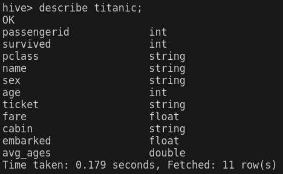

Practica Nifi

Se crearé un pipeline que contará con la siguiente estructura: 


Este pipeline cumplirá con las siguientes consignas.

1. En el shell de Nifi, crear un script .sh que descargue el archivo titanic.csv al directorio /home/nifi/ingest (crearlo si es necesario). Ejecutarlo con ./home/nifi/ingest/ingest.sh

El archivo [src/ingest.sh](src/ingest.sh) en el contenedor de nifi:

```bash
wget https://dataengineerpublic.blob.core.windows.net/data-engineer/titanic.csv
```

2. Usando procesos en Nifi:
* Tomar el archivo titanic.csv desde el directorio /home/nifi/ingest.
* Mover el archivo titanic.csv desde el directorio anterior, a /home/nifi/bucket (crear el
directorio si es necesario)
* Tomar nuevamente el archivo, ahora desde /home/nifi/bucket
* Ingestarlo en HDFS/nifi (si es necesario, crear el directorio con hdfs dfs -mkdir /nifi )

El proceso completo en nifi se visualiza de la siguiente manera:


3. Una vez que tengamos el archivo titanic.csv en HDFS realizar un pipeline en Airflow que
ingeste este archivo y lo cargue en HIVE, teniendo en cuenta las siguientes
transformaciones:
* Remover las columnas SibSp y Parch
* Por cada fila calcular el promedio de edad de los hombres en caso que sea
hombre y promedio de edad de las mujeres en caso que sea mujer
* Si el valor de cabina en nulo, dejarlo en 0 (cero)

Las transformaciones se realizaron en Spark en el archivo: [src/titanic-pyspark.py](src/titanic-pyspark.py).

El dag de Airflow está en el archivo: [src/titanic.py](src/titanic.py).

El dag se muestra acontinuación: 


Previo a correr el dag en Hive hay que crear la base de datos donde se creará la tabla, esto se hace entrando a su entorno y ejecutando: 

```Hive
create database titanicdb;
```

A continuación se muestra el dag que ha corrido exitosamente. 


La tabla en Hive posee la siguiente estructura:



El marco rojo es el promedio de edades según el sexo, el otro recuadro es la columna en la que se eliminaron los elementos nulos. 


8) Una vez con la información en el datawarehouse calcular:

* Cuántos hombres y cuántas mujeres sobrevivieron.

```SQL
select sex, count(passengerid) 
from titanic 
group by sex;
```


* Cuántas personas sobrevivieron según cada clase (Pclass)

```SQL
select pclass ex, count(passengerid) 
from titanic 
group by pclass;
```


* Cuál fue la persona de mayor edad que sobrevivió

```SQL
select name, age, sex, cabin, ticket 
from titanic 
order by age DESC 
limit 1;
```


* Cuál fue la persona más joven que sobrevivio

```SQL
select name, age, sex, cabin, ticket 
from titanic 
where age is not null 
order by age ASC
limit 1;
```


